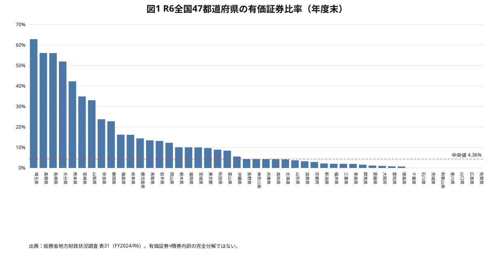
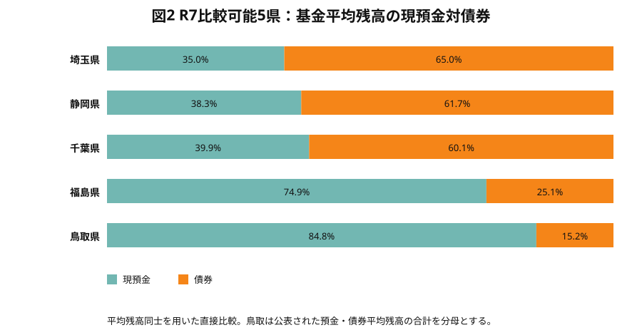
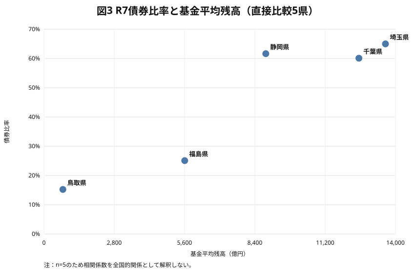
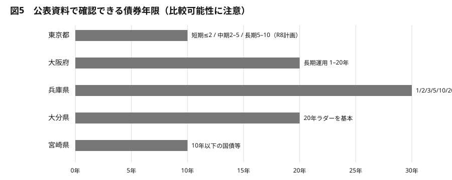
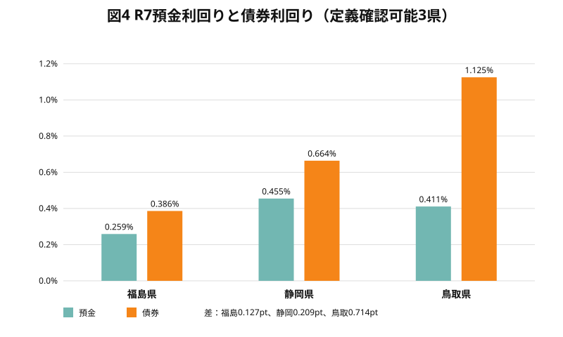
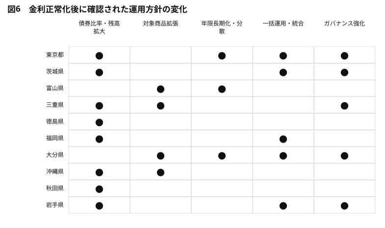

# 全国都道府県における基金・公金の債券運用実態
## ― R7の現預金・債券配分、利回り、年限、運用手法、ガバナンスの比較 ―

**調査基準日：2026年9月15日**  
**対象年度：令和7年度（FY2025）を中心に、令和4～6年度および令和8年度公表資料を補助的に使用**  
**使用情報：都道府県、総務省・e-Stat、e-Gov、IMF、OECD、World Bank等の公開情報のみ。内部資料・庁内限定情報は使用していない。**

---

# エグゼクティブ・サマリー

都道府県の基金・公金運用を比較すると、まず目につくのは債券比率の差である。令和7年度の年間実績について、**「基金」「年間平均残高」「現預金と債券の双方」**を同じ基準で確認できた5県では、債券比率は鳥取県15.23％、福島県25.08％、千葉県60.10％、静岡県61.65％、埼玉県65.00％であった。最大と最小の差は49.77ポイントに達する。ところが、この数字だけを並べても、どの県の運用が優れているかは分からない。差を生んでいるのは運用姿勢だけではなく、基金の目的、取崩し時期、一括運用の範囲、資金需要、満期構成、対象商品の違いだからである。

本調査の主要な発見は次のとおりである。

1. **R7の運用実態を一定程度定量把握できる県は限られる。** 厳格な比較可能性判定ではA=2県、B=6県、C=6県、D=28県、E=5県である。A・Bは47県の17.0％、一部定量値を含むCまで広げても29.8％にとどまる。これは債券運用の差だけでなく、公金運用情報の開示差そのものが大きいことを意味する。

2. **直接比較できる5県の債券比率は15.23～65.00％と大きく分散する。** 逆に現預金比率は35.00～84.77％である。この5県の単純平均は債券45.41％だが、サンプル選択が強いため「全国平均」とは呼べない。

3. **6割前後の債券比率は一つの運用パターンではない。** 埼玉県65.0％、静岡県61.65％、千葉県60.10％はいずれも高いが、一括運用の仕組み、債券種別、満期管理、預金運用の競争性は異なる。したがって「債券60％」という同じ数値から同じALMを推測してはならない。

4. **15～30％程度の県も、必ずしも消極運用ではない。** 福島県25.08％は基金現金の一括運用と債券運用を組み合わせ、鳥取県15.23％では債券利回り1.125％、預金利回り0.411％が公表されている。低い債券比率は、短期資金需要や基金構成を反映している可能性がある。

5. **年度末ベースでは、福岡県のR7債券比率は約74.92％に達する。** 債券6,939.5億円、預金2,323.2億円、全体利回り0.715％である。ただしこれは出納整理期間後の年度末残高であり、平均残高ベース5県とは別枠で扱う。

6. **使用される債券は国債だけではない。** 国債、地方債、政府保証債、地方公共団体金融機構（JFM）債、財投機関債、高速道路会社債等が確認される。兵庫県ではR7新規購入に複数年限・複数発行体を組み合わせ、大分県も高速道路会社債等を対象に含める。

7. **年限管理が明確な県では、満期分散が中核である。** 兵庫県はR7新規購入668億円を1、2、3、5、10、20、30年に分散し、平均購入年限6.21年。大分県は20年ラダーを基本とする。大阪府では長期運用を1～20年程度で管理し、東京都はR8から短期・中期・長期を重ねる複合ラダー型を明確化した。

8. **金利正常化後の変化は「債券比率上昇」だけではない。** 埼玉県は同一公表系列でR6の債券比率66.6％からR7の65.0％へやや低下した一方、基金利回りは0.349％から0.609％へ上昇した（出典：`R6-SAITAMA`, `R7-SAITAMA`）。千葉県も債券比率は60.0％から60.1％とほぼ横ばいだが、利回りは0.331％から0.482％へ上昇した（出典：`R6-CHIBA`, `R7-CHIBA`）。既存債券の償還・再投資と預金金利上昇が収益改善に寄与している。

9. **運用高度化に共通して見えるのは、債券比率そのものより運用インフラである。** 一括運用、年間・中長期資金計画、満期分散、ラダー、商品基準、運用委員会・外部有識者、実績公表が複数の県で組み合わされている。

10. **全国共通の「適正債券比率」は確認できない。** IMF、OECD、World Bankの政府キャッシュマネジメント論も、必要キャッシュ量を固定比率で示すのではなく、キャッシュフローの変動、予測精度、資金調達アクセス、支払義務、リスク許容度を踏まえて設定する考え方を採る（出典：`IMF-CASH-2020`, `OECD-2025`, `WB-CASH`）。自治体運用の高度化とは、債券比率を最大化することではなく、必要流動性を測ったうえで、残余資金を適切な満期へ配分することである。

---

# 第1章　なぜ今、自治体の債券運用を見るのか

日本銀行の金融政策正常化に伴い、長く低位にあった預金・債券金利の双方が上昇した。ゼロ金利期には、長期債券を購入しても得られる追加収益が小さく、将来の資金需要を拘束するコストが相対的に大きかった。金利が上昇すると、その関係は変わる。数年先まで使用予定のない資金について、預金だけでなく国債・地方債等へ配分する経済的意味が再び大きくなる。

しかし、そこで「金利が上がったから債券を増やすべきだ」と結論するのは早い。自治体の公金は自己資金だけからなる投資ポートフォリオではない。歳計現金には日々の支払があり、基金には設置目的と取崩し予定があり、災害や補正予算で予想外の資金需要も生じる。地方自治法第235条の4は歳計現金を「最も確実かつ有利な方法」で保管することを求め、第241条第2項は基金を「特定の目的に応じ、及び確実かつ効率的に」運用することを求める（出典：`LAW-LOCAL-AUTONOMY`）。収益性だけでなく、元本保全と支払準備性が制度上の前提である。

したがって本報告書が見るのは、単純な利回りランキングではない。「どれだけ債券を持つか」に加え、「どれだけ現金を残すか」「債券はいつ償還されるか」「複数基金をまとめて管理するか」「予想外の支払にどう対応するか」を同じ画面で見る。

---

# 第2章　データと比較上の注意

本調査では二つのデータ層を分離した。

第一は、総務省・e-Stat「地方財政状況調査」表31によるR4～R6の全国統一データである。これは年度末の積立基金について、現金・預金、有価証券等の管理状況を47都道府県で同じ様式で把握できる。全国分布を見るには非常に有用である。

第二は、各都道府県が独自に公表するR7の公金管理・資金運用実績である。こちらは年間平均残高、日平均残高、年度末残高、基金のみ、公金全体など定義が県ごとに異なる。一方で、債券利回り、年限、ラダー、一括運用といった実務情報は国の統一統計より詳しい。

ここで重要な監査結果がある。**総務省表31の「年度末有価証券」と、各県の「運用実績上の平均債券残高」は同じものではない。** 千葉県は総務省表31のR6年度末有価証券比率が0.023％である一方、県の公金運用実績ではR6基金の平均債券比率が60.0％である。これは異常値ではなく、基金の運用・資金帰属・集計方法が違うためと考えるべきである。したがって本報告書では、総務省系列から各県公表系列へ直接つないで「R6→R7に何ポイント上昇」と計算しない。

比較可能性は次のA～Eで評価した。

| ランク   |   県数 | 意味                                             |
|:---------|-------:|:-------------------------------------------------|
| A        |      2 | 残高・利回り・年限・管理手法まで相当程度把握可能 |
| B        |      6 | 主要定量項目を比較可能                           |
| C        |      6 | 一部定量値はあるが時点・範囲・欠落に制約         |
| D        |     28 | 方針・制度・部分数値中心                         |
| E        |      5 | R7実態の定量把握に使える公開情報をほぼ確認できず |

「E」は債券を保有していないことを意味しない。**公開情報からR7実態を数量比較できなかった**という判定である。

---

# 第3章　R4～R6の全国47都道府県の基金運用構造

R6年度末の総務省統一データでは、47都道府県の有価証券比率は単純平均12.30％、中央値4.36％、第1四分位1.40％、第3四分位13.96％であった。平均が中央値を大きく上回るのは、一部の高比率県が分布の右裾を引き上げるためである。

上位10県は次のとおりである（出典：`STAT-R6-MIC`）。

| 都道府県   |   R6年度末有価証券比率 |
|:-----------|-----------------------:|
| 埼玉県     |                  62.89 |
| 島根県     |                  56.14 |
| 長崎県     |                  56.09 |
| 大分県     |                  51.97 |
| 熊本県     |                  42.32 |
| 宮崎県     |                  34.93 |
| 山梨県     |                  33.08 |
| 奈良県     |                  23.79 |
| 静岡県     |                  22.79 |
| 福島県     |                  16.27 |

ここで疑問が生じる。なぜ埼玉県では6割超なのに、同じ都道府県でもゼロに近い県があるのか。総務省統計だけでは答えは出ない。基金の中身、運用期間、一括運用、年度末の資金移動によって数字が変わるためである。このためR4～R6データは「全国分布の地図」として使い、R7各県資料は「運用メカニズムを調べる顕微鏡」として使う。

---

# 第4章　R7の現預金・債券配分

年間平均残高ベースで直接比較可能な5県は次のとおりである。

| 都道府県   |   平均残高（百万円） | 現預金比率   | 債券比率   | 全体利回り   | 預金利回り   | 債券利回り   |   運用収入（百万円） | Source ID |
|:-----------|---------------------:|:-------------|:-----------|:-------------|:-------------|:-------------|---------------------:|:----------|
| 福島県     |              560,678 | 74.917%      | 25.083%    | 0.291%       | 0.259%       | 0.386%       |               1629.9 | `R7-FUKUSHIMA` |
| 埼玉県     |            1,360,100 | 34.997%      | 65.003%    | 0.609%       | —            | —            |               8280.7 | `R7-SAITAMA` |
| 千葉県     |            1,254,300 | 39.903%      | 60.097%    | 0.482%       | —            | —            |               6049.5 | `R7-CHIBA` |
| 静岡県     |              883,500 | 38.347%      | 61.653%    | 0.535%       | 0.455%       | 0.664%       |               4730   | `R7-SHIZUOKA` |
| 鳥取県     |               75,500 | 84.768%      | 15.232%    | 0.520%       | 0.411%       | 1.125%       |                392.5 | `R7-TOTTORI` |

この5県では債券比率が15.23～65.00％に分散する。中央値は60.10％だが、5県は「詳細な公開を行っている県」という選択されたサンプルであり、全国中央値ではない。

補助比較群は次のとおりである。

| 都道府県   | 対象                    | 期間・時点                               | 債券比率   | 全体利回り   | 比較上の注意                                                                               | Source ID |
|:-----------|:------------------------|:-----------------------------------------|:-----------|:-------------|:-------------------------------------------------------------------------------------------|:----------|
| 東京都     | prefecture_funds        | annual_actual_plus_R7_portfolio_estimate | 35.0%      | 0.553%       | 年間平均残高・利回り・収入は確定実績。配分はR8計画資料に掲載されたR7実績見込み（丸め値）。 | `R7-TOKYO`, `R8-TOKYO-PLAN` |
| 福岡県     | prefecture_funds        | year_end_actual                          | 74.9%      | 0.715%       | 出納整理期間後年度末残高。平均残高ベースの5県とは別枠。                                    | `R7-FUKUOKA` |
| 大阪府     | prefecture_public_money | annual_forecast                          | —          | 0.442%       | R7見込み。長期運用平均2,906億円を債券残高と同義にしない。                                  | `R7-OSAKA` |
| 兵庫県     | prefecture_public_money | annual_actual                            | 27.3%      | 0.636%       | 基金単独ではなく資金管理全体。R7新規購入平均年限6.21年。                                   | `R7-HYOGO` |
| 宮崎県     | public_money_combined   | latest_actual_2025-08-31                 | 28.5%      | —            | 年度途中かつ歳計現金・基金等を含む公金全体。運用益650百万円は基金の見込み。                | `R7-MIYAZAKI` |
| 大分県     | prefecture_funds        | annual_actual                            | —          | 0.615%       | 基金平均残高・利回り・20年ラダーは確認可能。債券残高は本調査で確認できず。                 | `R7-OITA` |

特に福岡県は年度末ベースで債券約74.92％、預金約25.08％である。これは高い債券比率の明確な事例だが、平均残高5県と同じランキングへ入れることはしない。兵庫県の27.30％も県資金管理全体であり、基金単独ではない。

---

# 第5章　債券比率はなぜ県によって違うのか

債券比率60％前後の県を見ても、共通するのは「積極運用」という抽象的な姿勢ではない。埼玉県、千葉県、静岡県はいずれも長期資金を債券へ回しているが、現預金も3～4割残している。これは債券運用と現金保有が代替関係だけではなく、流動性階層を作る補完関係であることを示す。

福島県は債券25.08％、鳥取県は15.23％である。これを「慎重すぎる」と評価することはできない。鳥取県では債券利回りが預金利回りを0.714ポイント上回るが、それでも平均残高の約85％を現預金に置く。つまり、利回り差が存在しても全額を債券化しない合理的理由がある。流動性需要、基金の期間構成、購入機会、管理コストがその候補となる。

実務上、債券比率を説明する変数として少なくとも次が必要である。①翌年度までの取崩予定、②月次支払の振れ、③災害等の臨時支出、④一時借入・資金繰替の利用可能性、⑤基金間の資金融通・一括運用、⑥債券の満期構成、⑦預金金利とのスプレッドである。公開資料ではこれらを全県で数量化できないため、本報告書は因果関係を断定しない。

---

# 第6章　国債・地方債・政府関係機関債等の使い分け

自治体の「債券運用」は国債購入だけではない。公表方針・実績からは、国債、地方債、政府保証債、JFM債、財投機関債、政府関係機関債、高速道路会社債等が確認できる。

安全性の考え方も県によって異なる。国・地方公共団体等に発行体を限定する県もあれば、一定の信用力を持つ政府関係機関・公共性の高い会社債まで対象を拡張する県もある。大分県は国債・政府保証債・地方債・JFM債・財投機関債・高速道路会社債等を対象とし、原則満期保有を採る。富山県ではR7に財投機関債等を対象へ追加したことが確認できる。

この違いの意味は、単なる利回り追求ではない。発行体を分散すれば信用リスクの集中を避けやすくなる一方、商品範囲を拡げるほど審査・モニタリング能力が必要になる。「国債中心型」と「準政府・公共セクターへ広げる型」では、同じ債券比率でも管理体制が異なる。

---

# 第7章　債券の年限とラダー運用

「債券をいくら持つか」と同じくらい重要なのが、「いつ現金に戻るか」である。

兵庫県はR7の新規債券購入668億円を1年、2年、3年、5年、10年、20年、30年へ分散し、平均購入年限6.21年、加重平均利率1.363％としている。これは短・中・長期を明示的に組み合わせた満期分散である。

大分県は20年ラダーを基本とする。毎年度の償還額を平準化できれば、一部の資金が毎年現金化され、再投資機会も分散される。金利が上昇しても低下しても、一度に全額を同じ金利で固定するリスクを避けられる。

大阪府では長期運用計画と財務マネジメント委員会を組み合わせ、20年債を含む商品を検討している。東京都はR8から、短期2年以下、中期2年超～5年以下、長期5年超～10年以下を重ねる「複合ラダー型ポートフォリオ」を明示した。これはR7の実績そのものではないが、R7に債券割合を段階的に高めた次の制度進化として重要である。

年限を長くすれば通常は利回り上昇余地がある一方、満期まで資金を拘束する。途中売却を行わず満期保有を原則とする自治体では、価格変動そのものよりも「予定より早く現金が必要になるリスク」が中心になる。したがってラダーは収益手法というより、流動性リスクと再投資リスクを管理するALM手法として理解すべきである。

---

# 第8章　基金一括運用と公金統合管理

基金を個別運用すると、それぞれが近い将来の支払に備えて現金を抱える。その結果、県全体では過剰な流動性を持つことがある。複数基金を一括管理すると、個別基金の支払タイミングが重ならない限り、県全体で必要な支払準備金を圧縮し、残余資金の運用期間を長くできる可能性がある。

静岡県は長期にわたり基金一括運用を行う。福岡県は全基金を財政課で一括運用する。大分県も原則一括運用、熊本県は歳計現金・歳入歳出外現金・基金を一括して管理する。東京都もR8から特定目的基金への一括運用導入を明示した。

ただし、一括運用それ自体が高い債券比率を生むと断定することはできない。一括運用は「長く運用できる資金を見つけやすくする」仕組みであり、その資金を預金に置くか債券に置くかは金利環境とリスク管理の別判断だからである。

---

# 第9章　運用利回りと収益

R7では、確認できる範囲で利回りが明確に上昇している。東京都の基金は平均残高3兆7,921億円、利回り0.553％、運用収入209億7,350万円。埼玉県は平均残高1兆3,601億円、利回り0.609％、基金運用収入約82.8億円。千葉県は1兆2,543億円、0.482％、約60.5億円。静岡県は8,835億円、約0.535％、47.3億円である。

しかし利回りランキングには慎重さが必要である。債券比率、過去に購入した債券のクーポン、満期構成、預金の引合い頻度、平均残高の計算方法が違うためである。

商品別利回りを確認できる3県を見ると、福島県は預金0.259％、債券0.386％で差0.127ポイント、静岡県は0.455％対0.664％で0.209ポイント、鳥取県は0.411％対1.125％で0.714ポイントである。同じ年度でもスプレッドは大きく違う。

債券利回りが預金を上回る事例は明確だが、その差をそのまま未実現の「機会損失」とみなすことはできない。預金が担っている即時流動性には経済的価値があるためである。

---

# 第10章　金利正常化で変わる自治体運用

R7前後の変化は、おおむね五つに分類できる。

第一は債券比率・残高の引上げである。東京都、茨城県、徳島県等で明示的な拡大方針が確認される。

第二は対象商品の拡張である。富山県の財投機関債等、三重県の国庫短期証券、大分県の高速道路会社債等が例である。

第三は年限の長期化・分散である。東京都の短中長期ポートフォリオ、兵庫県の1～30年、大分県の20年ラダーが該当する。

第四は一括運用・統合管理である。東京都のR8一括運用、福岡県の全基金一括、大分・熊本等の統合管理が確認できる。

第五はガバナンスである。大阪府の財務マネジメント委員会、東京都の外部有識者活用、岩手県の外部助言・人材育成研究等である。

重要なのは、金利正常化に対する反応が「債券を増やす」の一方向ではないことである。埼玉県では債券比率がR6 66.6％からR7 65.0％へ低下しているにもかかわらず、基金利回りは0.349％から0.609％へ上昇した（出典：`R6-SAITAMA`, `R7-SAITAMA`）。千葉県も債券比率60.0％→60.1％とほぼ横ばいで、利回りは0.331％→0.482％へ上昇した（出典：`R6-CHIBA`, `R7-CHIBA`）。既存ポートフォリオの償還・再投資や預金金利上昇による改善を見落としてはならない。

---

# 第11章　先進自治体ケーススタディ

## 11.1 東京都 ― 大規模資金を四半期管理し、R8に複合ラダーへ進む

東京都の特徴は、残高規模だけでなく、四半期ごとに運用実績を公表しながらポートフォリオを段階的に変更している点にある。R7の基金平均残高は3兆7,921億円、利回り0.553％、運用収入209億7,350万円。公金全体では平均残高6兆800億円、利回り0.494％、運用収入300億961万円であった。

R7中に基金の債券割合を段階的に引き上げ、第1四半期後も短い年限の債券を購入した。R8計画に掲載されたR7実績見込みでは、基金約3兆7,900億円のうち債券1兆3,300億円、約35％。R8は43％を想定し、特定目的基金の一括運用と複合ラダー型を導入する。特徴を一言で表せば、**「巨額資金を一括管理・年限階層化する方向へ制度自体を更新している県」**である（出典：`R7-TOKYO`, `R8-TOKYO-PLAN`）。

## 11.2 埼玉県 ― 6割超の債券比率を恒常的に維持

R7の基金平均残高は1兆3,601億円、債券8,841億円、預金4,760億円で、債券比率65.0％。利回り0.609％、運用収入約82.8億円である。R6も同一系列で債券比率66.6％であり、高債券比率は単年度の特殊要因ではない。

一方、R7は比率がわずかに低下しながら利回りは上昇した。ここから読み取れるのは、金利正常化期の収益改善は資産配分比率の変更だけでは測れないということである。特徴は、**「高い債券比率を基礎に、金利上昇局面の再投資・預金金利改善を収益へ取り込む成熟型ポートフォリオ」**である（出典：`R6-SAITAMA`, `R7-SAITAMA`）。

## 11.3 千葉県 ― 6割債券・4割預金の安定構成

R7基金平均残高1兆2,543億円、債券7,538億円、預金5,005億円。債券60.1％、預金39.9％、利回り0.482％、運用収入約60.5億円である。R6の同一公表系列でも債券は約60％で、構成はほぼ不変であった。

にもかかわらず利回りは0.331％から0.482％へ上昇している。特徴は、**「資産配分を大きく変えず、金利環境改善を収益へ取り込む型」**である（出典：`R6-CHIBA`, `R7-CHIBA`）。なお総務省表31とは表示が大きく異なるため、全国統一年度末統計との接続には特に注意が必要である。

## 11.4 静岡県 ― 一括運用と商品別利回り開示が強み

R7基金平均残高8,835億円、債券5,447億円、預金3,388億円で、債券比率61.65％。全体利回り約0.535％、預金0.455％、債券0.664％、基金運用収入47.3億円である。

静岡県は基金一括運用を早期から実施し、預金についても競争性を確保した運用を行う。債券だけでなく預金金利も相対的に高く、ポートフォリオ全体の収益管理が見える。特徴は、**「一括運用の成熟度と、預金・債券双方の収益管理を組み合わせる型」**である（出典：`R7-SHIZUOKA`）。

## 11.5 福島県 ― 現預金を厚く残す中間型

R7基金平均残高約5,606.8億円、債券約1,406.4億円、現金・預金約4,200.4億円。債券25.08％、現預金74.92％である。預金利回り0.259％、債券0.386％、全体0.291％、運用収入約16.3億円。

6割超の県と比べれば債券比率は低いが、債券を使っていないわけではない。基金現金を一括運用しつつ債券を別管理する構造が確認できる。特徴は、**「流動性を厚く確保しながら債券を組み込む中間型」**である（出典：`R7-FUKUSHIMA`）。

## 11.6 大阪府 ― 委員会型ガバナンスで長期運用を管理

大阪府の公表資料は基金単独ではなく公金全体を含むため、基金比率の横並びには適さない。一方、財務マネジメント委員会の資料は、長期運用額、商品、年限、債券購入方針まで詳細である。R7見込みでは全体平均運用8,923億円、長期運用2,906億円、全体利回り0.442％、長期運用利回り0.739％。

特徴は、**「運用結果よりも意思決定過程の透明性が高いガバナンス型」**である（出典：`R7-OSAKA`）。債券運用を投資担当だけの判断に閉じず、長期計画を委員会で点検する点に実務的価値がある。

## 11.7 兵庫県 ― 年限情報の開示が最も具体的な県の一つ

R7の県資金管理全体では短期運用平均6,109億円、債券2,294億円、計8,403億円。利回り0.636％。新規債券購入は668億円、平均購入年限6.21年、加重平均利率1.363％で、1～30年へ分散する。

このデータは「債券が何％か」だけでは見えない流動性構造を示す。特徴は、**「購入年限まで公開し、ラダー・満期分散を数量で検証できる県」**である（出典：`R7-HYOGO`）。

## 11.8 鳥取県 ― 小規模でも商品別利回りを明示

R7の基金運用平均残高755億円、預金640億円、債券115億円で、債券比率15.23％。預金利回り0.411％、債券1.125％、運用収入約3.93億円である。

債券利回りは預金を大きく上回るが、債券比率は低い。この組合せは、流動性制約を無視して利回り差だけで債券比率を決めていないことを示唆する。特徴は、**「債券比率は低いが商品別の収益性が明確な、小規模・透明型」**である（出典：`R7-TOTTORI`）。

## 11.9 大分県 ― 20年ラダーを明示する長期分散型

R7の基金平均残高は約1,370.3億円、運用収入8.42億円、利回り0.615％。償還差益を除くと0.602％である。債券残高の統一的な数値は確認できないが、20年ラダーを基本とし、高速道路会社債等を含む商品群を利用する。

特徴は、**「債券比率ではなく満期構造を軸に長期資金を管理するラダー型」**である（出典：`R7-OITA`）。債券残高が非公表であるため、配分比較ではなく運用手法のケースとして位置づける。

## 11.10 福岡県 ― 全基金一括・年度末約75％債券

R7年度末、基金の債券残高は約6,939.5億円、預金約2,323.2億円、合計約9,262.7億円。債券比率は74.92％、全体利回り0.715％、運用利子約69.9億円。全基金を財政課で一括運用する。

平均残高ベースではないため埼玉・静岡等との順位比較は避けるが、高債券比率の代表例として重要である。特徴は、**「全基金一括運用を基盤に、信用力の高い債券へ大規模配分する型」**である（出典：`R7-FUKUOKA`）。

## 11.11 宮崎県 ― 公金全体で預金・債券を明示する移行型

R7年8月末の公金全体で、定期性預金約1,307億円、債券約522億円、合計約1,829億円。単純構成比では債券28.54％である。基金運用利益は約6.5億円を見込むとされた。

年度途中値かつ基金単独ではないため、R7年間基金ランキングには使わない。ただし、10年以下の国債や安全性の高い公社債を使うことが議会答弁で確認できる。特徴は、**「公金全体で債券利用を拡げている途中段階を数量で確認できる県」**である（出典：`R7-MIYAZAKI`）。

---

# 第12章　都道府県の運用類型

全国を単一の順位に並べるより、複数属性で捉える方が実態に近い。本調査では次のタグを用いる。

**高債券比率型**：比較可能な分母で概ね55％以上。埼玉、千葉、静岡、年度末ベースの福岡等。  
**中程度債券型**：概ね25～55％。福島、公金全体ベースの兵庫・宮崎等。  
**現預金比重大型**：比較可能な範囲で債券25％未満。鳥取等。  
**年限・ラダー管理型**：東京都、大阪、兵庫、大分、岡山、熊本、高知等。  
**一括運用型**：静岡、福岡、大分、熊本、茨城、岩手、東京都（R8）等。  
**債券運用拡大型**：東京都、茨城、富山、三重、徳島、福岡、大分、沖縄、秋田、岩手等。  
**公開情報不足型**：R7比較可能性E。

これらは排他的ではない。福岡県は「高債券比率」「一括運用」の双方、大分県は「ラダー」「一括運用」「対象商品拡張」の複数属性を持つ。複数タグにすることで、比率と制度を混同しない。

---

# 第13章　公金運用の情報開示

今回の調査で最も意外な結果の一つは、運用実態以上に開示格差が大きいことである。R7の厳格判定はA=2、B=6、C=6、D=28、E=5であった。

A・Bの8県は、主要定量値を比較できる。Cは一部数値があるが、年度末・途中値・見込・公金全体等の制約を持つ。Dでは方針や議会答弁は追えるがポートフォリオを再構成できない。EではR7の実態を数量化できる公開情報をほぼ確認できない。

透明性の高い開示には、少なくとも次の要素が必要である。①対象資金の定義、②平均残高、③預金・債券別平均残高、④商品別残高、⑤運用収入、⑥利回りと計算方法、⑦年限・満期構成、⑧運用方針・リスク管理、⑨前年度比較である。

東京都が四半期・年間実績とダッシュボードを公開し、兵庫県が新規債券購入年限まで示す一方、多くの県では決算上の基金残高しか分からない。この差は、外部から運用の妥当性を検証する能力に直結する。

---

# 第14章　学術・実務理論からみた全国実態

政府キャッシュマネジメントの目的は、投資収益の最大化ではなく、**必要な支払を期日に確実に実行し、その制約下で保有現金のコストを最小化すること**にある。

IMFは、キャッシュバッファをキャッシュフロー変動や資金調達リスクへの保険として捉え、適切な水準は支払の不確実性と資金調達手段の利用可能性に依存すると整理する（出典：`IMF-CASH-2020`）。OECDの2025年レビューも、キャッシュ予測、目標残高、短期運用、ガバナンスを一体の仕組みとして扱う（出典：`OECD-2025`）。World Bankも、キャッシュフロー予測を基礎に目標残高を設定し、過剰な遊休資金と資金不足の双方を避ける考え方を示す（出典：`WB-CASH`）。

この枠組みで全国実態を読み直すと、一括運用はTreasury Single Accountに近い「資金集約」の国内自治体版、ラダーはmaturity matchingと再投資リスク管理、現預金はliquidity bucketと解釈できる。

したがって、理論的にも「基金の60％を債券にすべき」といった全国一律基準は導けない。適正配分は、将来キャッシュフロー、基金の目的、満期分散、緊急時の資金アクセス、預金・債券スプレッドによって変わる。

より実務的には、次の順序が合理的である。

**第1層：即時流動性** ― 日々の支払、予測誤差、緊急支出に備える現預金。  
**第2層：短期運用** ― 数週間～1、2年程度使わない資金を定期預金や短期債券へ。  
**第3層：中期運用** ― 2～5年程度の資金を満期分散。  
**第4層：長期運用** ― 5年以上使用予定が明確にない資金を長期債券へ。ただし毎年度の償還額を分散する。

自治体間の違いは、この各層へどれだけ資金を置けるかの違いと理解するのが最も自然である。

---

# 結論

R7の都道府県公金運用を公表情報だけで追うと、全国に単一のポートフォリオは存在しない。直接比較できる5県だけでも債券比率は15.23～65.00％、年度末ベースの福岡県は約74.92％である。差は大きい。

しかし、本調査が示したより重要な結論は、「高債券比率＝高度運用」ではないことである。東京都、大阪府、兵庫県、大分県などの事例で目立つのは、債券残高ではなく、キャッシュフロー管理、満期分散、一括運用、運用計画、商品基準、委員会・外部有識者、継続的な実績公表である。

金利正常化によって自治体の行動は変わりつつある。債券運用割合を引き上げる県、対象商品を増やす県、年限を長くする県、一括運用へ移る県がある。一方、既に高債券比率の県では、比率を増やさずとも再投資利回り上昇によって運用収益が増えている。

したがって自治体公金運用の核心的な問いは、「債券を何％持つべきか」ではない。

**必要なキャッシュはいくらか。残りの資金はいつまで使わないのか。その期間に合う満期の債券をどう分散して持つのか。**

全国比較から見えるのは、この問いに対する制度設計が県ごとに大きく異なっているという事実である。そして、その違いを外部から検証できるほど情報を開示している県は、まだ少数である。

---

# 付録A　データセット

- `stage3/processed/R7_national_comparison_table.csv`：47都道府県R7最終比較表
- `stage3/processed/R7_fund_allocation_core.csv`：平均残高基準で直接比較できる5県
- `stage3/processed/R7_supplementary_comparison.csv`：時点・対象範囲が異なる補助比較
- `stage3/processed/R7_strict_comparability_47.csv`：47県のA～E比較可能性
- `stage3/processed/management_features.csv`：一括運用・ラダー・リスク管理
- `stage3/processed/maturity_comparison.csv`：確認できる年限情報
- `stage3/processed/policy_change_matrix.csv`：金利正常化後の運用方針変化
- `stage3/processed/typology.csv`：複数属性による類型
- `stage3/processed/summary_statistics.csv`：Python再計算結果

# 付録B　主要な一次・理論資料

本文中の `Source ID` はすべて `stage3/sources/source_dictionary.csv` に対応する。一次資料URLと役割も同ファイルに収録した。主要資料は、総務省・e-Stat表31、各都道府県公金管理・資金運用実績、地方自治法第235条の4・第241条、IMF *How to Set Up a Cash Buffer*、OECD *Managing Government Cash*、World Bank *Forecasting and Targeting Government Cash Balances* である。

# 付録C　計算方法

- R7直接比較の債券比率 = 債券平均残高 ÷（現預金平均残高＋債券平均残高）×100
- 現預金比率 = 現預金平均残高 ÷ 同分母 ×100
- 商品別利回り差 = 債券利回り－預金利回り
- R6有価証券比率 = 総務省表31「有価証券」÷積立基金合計×100
- 比率・平均・中央値・四分位点・構成比はPythonで再計算
- 年度末値と平均残高は別群とし、同一ランキングには入れない
- 「有価証券」と「債券」を同義扱いしない
- 「見つからない」を「保有していない」と解釈しない
