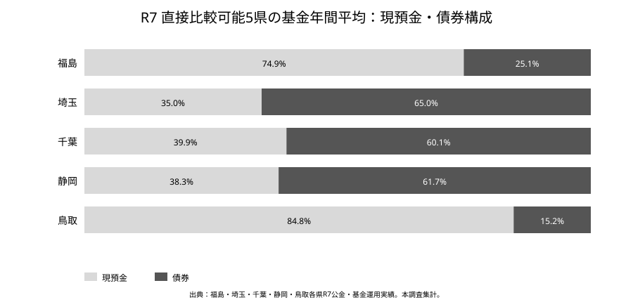
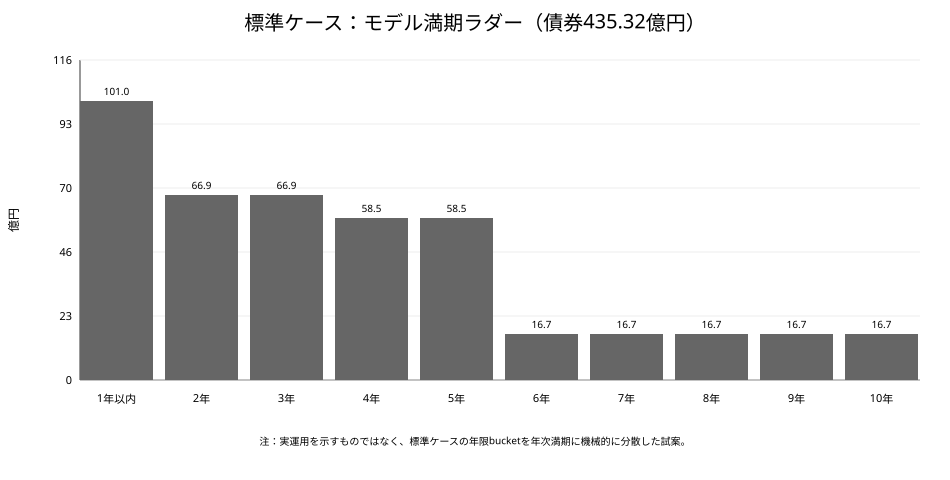

# 愛媛県における基金の債券運用高度化に向けた調査分析
## ― 全国のR7以降の運用動向、必要流動性及び基金別ALMからみた運用余地 ―

**調査基準日：2026年9月16日**  
**想定読者：愛媛県の基金・公金・財政・会計・資金運用担当者**  
**情報範囲：国・地方公共団体・国際機関・学術機関等が公表した情報のみ。内部資料、庁内限定資料及び非公表の実運用情報は使用していない。**

> 本報告書の中心的な問いは「愛媛県の債券比率を何％にすべきか」ではない。各基金の用途と支出時期、年度内の資金需要、財政上のバッファを先に把握し、**満期まで拘束しても支払能力を損なわない資金はいくらか**を求め、その資金をどの年限・商品へ配分するかを検討することである。

---

# Executive Summary

## 1. 結論の要旨

自治体の公金運用を取り巻く環境は、長期にわたる超低金利期から明確に変化した。日本銀行「資金循環統計」を基にした2026年9月13日付日本経済新聞の集計では、地方公共団体部門が保有する国債・財投債の残高は2025年3月の163億円から2026年3月には約1.6兆円へ増加した。これは「購入額が100倍」というフローの比較ではなく、**保有残高が約100倍となったストックの比較**であり、対象も都道府県だけでなく地方公共団体部門全体である。この統計的な限定を踏まえても、地方公共団体が再び債券運用を重要な選択肢としていることを示すマクロな変化である（出典：`NIKKEI-2026-09-13`, `BOJ-FFA-METHOD`）。

背景には、日本銀行が2024年3月にマイナス金利政策・イールドカーブ・コントロールを終了し、その後政策金利を段階的に引き上げるとともに、長期国債買入れを減額してきたことがある。10年国債利回りも上昇した。一方で預金金利も上昇しているため、「金利が上がったから国債が常に預金より有利」とは言えない。本報告書では、**金融環境の変化を確認事実として整理し、その変化が自治体の債券運用拡大を促したという説明は「本調査の考察」として明確に分ける**（出典：`BOJ-POLICY-2024-03`, `BOJ-POLICY-2024-07`, `BOJ-POLICY-2025-01`, `BOJ-POLICY-2025-12`, `BOJ-POLICY-2026-06`, `BOJ-DEPOSIT-RATES`）。

都道府県レベルでは、R7の基金年間平均残高について現預金と債券を同じ定義で直接比較できる5県の債券比率は、鳥取15.2％、福島25.1％、千葉60.1％、静岡61.7％、埼玉65.0％であり、現預金比率は逆に35.0～84.8％に分散している。5県の単純平均債券比率は45.4％だが、開示可能性によるサンプル選択が強いため全国平均とは扱わない。福岡県のR7年度末ベースでは債券比率74.9％が確認できる一方、これは年間平均残高の5県とは別基準である（出典：`R7-FUKUSHIMA`, `R7-SAITAMA`, `R7-CHIBA`, `R7-SHIZUOKA`, `R7-TOTTORI`, `R7-FUKUOKA`）。

また、「R7に全国一律で債券比率が急上昇した」とも言えない。同一系列で比較できる埼玉県では債券比率がR6の66.6％からR7の65.0％へやや低下する一方、基金運用利回りは0.349％から0.609％へ上昇した。千葉県も債券比率は60.0％から60.1％とほぼ横ばいだが、利回りは0.331％から0.482％へ上昇している。金利正常化の効果は、債券比率の上昇だけでなく、既存債の償還再投資や預金金利の上昇にも現れる（出典：`R6-SAITAMA`, `R7-SAITAMA`, `R6-CHIBA`, `R7-CHIBA`）。

愛媛県では、総務省の全国統一統計によるR6年度末基金総額は1,302.28億円、現金・預金1,286.87億円、有価証券15.40億円、有価証券比率1.18％であった。R6全国47都道府県の有価証券比率は単純平均12.30％、中央値4.36％、第1四分位1.40％、第3四分位13.96％であり、R6時点の愛媛県は第1四分位を下回る。ただし、これはR6年度末の統一統計であり、R7の実際の基金債券残高を示すものではない。2026年9月16日時点で、R7基金全体の債券残高・購入額・利回り・年限を全国比較できる形の愛媛県公表資料は確認できないため、本報告書ではR6値をR7現在値として代用しない（出典：`STAT-R6-MIC`, `EHIME-ACCOUNTING-2026`）。

愛媛県の特徴は、基金が長期貯蓄だけでなく年度内資金繰りの大きな流動性源として機能している点にある。R3～R6の財務書類から構造化した16期間の基金繰替額は203.51～968.01億円で、中央値659.18億円、P75は765.91億円、P90は841.26億円であった。季節平均は4～5月775.72億円、夏期325.31億円、秋期614.24億円、年度末782.29億円であり、資金需要に強い季節性がある（出典：`EHIME-FS-R3`, `EHIME-FS-R4`, `EHIME-FS-R5`, `EHIME-FS-R6`; 本調査集計）。

さらに、県の財政運営基本方針は財源対策用基金について400億円規模を安定的に確保する目標を置く。平成30年西日本豪雨時の183億円、平成16～18年度の地方交付税減少407億円、R6～R8の機械的な財源不足見込み計333億円、県有施設更新費平均約180億円／年は、それぞれストレス、短中期負債、長期予定支出を測る材料であるが、相互に重複するため400億円へ単純加算してはならない（出典：`EHIME-POLICY-2023`）。

R8当初予算では一般会計への基金繰入が32基金、計351.86億円計上されている。財政基盤強化積立金107.00億円、県債管理基金37.56億円、職員退職手当基金37.00億円、地域医療介護総合確保基金34.21億円、県立学校教育環境整備基金27.47億円など、今後1年程度で用途が見えている資金は、中長期のコア運用資金と同一視できない（出典：`EHIME-BUDGET-R8-EXPLANATION`）。

これらを踏まえ、R6基金総額1,302.28億円を共通分母としたtop-downの政策レンジは、保守151.27億円（債券11.6％）、標準435.32億円（33.4％）、積極574.70億円（44.1％）である。これは「最適額」ではない。標準ケースは過去最大繰替968.01億円を、即時現金765.91億円、near-cash 101.05億円、1年以内満期債101.05億円で100％カバーし、その外側を1～10年程度へ分散する中心的な検討ケースである。基金別のR7末又はR8期首現金残高が決算公表後に利用可能となるまでは、bottom-upで435.32億円を完全に裏付けたとは扱わない。

したがって本報告書の提案は、「他県の債券比率に合わせる」ことではなく、次の順序である。

1. 13週、1年、3～5年のキャッシュフロー予測を整備する。
2. 基金ごとに法定・政策フロア、1年以内の支出、1～3年の事業パイプライン、非現金資産を登録する。
3. 必要流動性を即時現金、near-cash、1年以内満期債に分解する。
4. 残余資金だけを、満期が毎年度到来するラダーへ配分する。
5. 債券種類、発行体、年限、投資時期を分散し、原則として途中売却を必要としない構造とする。
6. R7決算の基金別現金残高が公表された後、bottom-up計算を更新する。

第11章で示すポートフォリオは、愛媛県の現在の実際の運用を推定するものではない。公開資料だけから構築したモデル案であり、実施に当たっては県の運用規程、購入可能商品、支出予定、実際の保有資産を別途確認する必要がある。

---

# 第1章　なぜ今、自治体基金の債券運用を検討するのか

## 1.1 自治体の国債・財投債保有の急増

2026年9月13日付日本経済新聞は、日本銀行の資金循環統計を基に、地方公共団体部門の国債・財投債保有残高が2025年3月の163億円から2026年3月に約1.6兆円となったと報じた。約100倍という変化は注目に値するが、解釈には三つの注意が必要である。

第一に、比較しているのは購入額ではなく期末時点の保有残高である。第二に、対象は都道府県だけでなく市町村等を含む地方公共団体部門である。第三に、日本銀行の地方公共団体部門の金融資産系列には、基礎統計からの推計及び市場価格評価を含む。したがって、この1.6兆円を都道府県基金の新規購入額として使用してはならない（出典：`NIKKEI-2026-09-13`, `BOJ-FFA-METHOD`）。

一方、歴史的には地方公共団体が国債を保有すること自体は新しい現象ではない。超低金利期に国債等を保有する追加収益が縮小し、その後の金利正常化局面で再び残高が拡大したという長い時間軸で理解する必要がある。

## 1.2 金利環境の転換

日本銀行は2024年3月にマイナス金利政策及びイールドカーブ・コントロールの枠組みを終了した。2024年7月には政策金利を0.25％程度へ引き上げ、長期国債買入れの減額計画を示した。その後、2025年1月0.5％程度、2025年12月0.75％程度、2026年6月1.0％程度へと政策金利は段階的に引き上げられた（出典：`BOJ-POLICY-2024-03`, `BOJ-POLICY-2024-07`, `BOJ-POLICY-2025-01`, `BOJ-POLICY-2025-12`, `BOJ-POLICY-2026-06`）。

国債利回りも上昇し、2026年9月1日の10年国債入札では平均落札利回り2.995％が確認できる。一方、日本銀行の預金種類別店頭表示金利では、1,000万円以上・1年定期の平均金利も2026年6月に0.381％まで上昇している（出典：`MOF-JGB-AUCTION-2026-09`, `BOJ-DEPOSIT-RATES`）。年限の異なる10年国債と1年定期をそのまま利回り比較することはできないが、「預金金利も上昇している」という点は重要である。

## 1.3 本報告書の問題設定

金利上昇局面であっても、基金運用の第一目的を利回り最大化に置くべきではない。地方自治法は、歳計現金について「最も確実かつ有利な方法」、基金について特定目的に応じた確実かつ効率的な運用を求める。支払いに必要な時点で資金を確保できることが前提である（出典：`LAW-LOCAL-AUTONOMY`）。

したがって、本報告書の中心問いは次のとおりである。

> **必要流動性を確保した上で、満期まで拘束可能な資金はいくらあり、それをどの年限・商品へ配分するのが合理的か。**

この問いを、全国比較、愛媛県の基金繰替、基金別用途、財政上のストレス及び満期ラダーの5つの観点から検討する。

---

# 第2章　国債購入急増の背景

本章では、確認された事実と本調査の考察を分ける。

## 2.1 確認された事実

確認できる事実は、少なくとも次のとおりである。

- 地方公共団体部門の国債・財投債保有残高は2025年3月163億円から2026年3月約1.6兆円へ増加した（出典：`NIKKEI-2026-09-13`, `BOJ-FFA-METHOD`）。
- 日本銀行はマイナス金利・YCCを終了し、政策金利を段階的に引き上げ、国債買入れを減額した（出典：`BOJ-POLICY-2024-03`～`BOJ-POLICY-2026-06`）。
- 国債利回りは上昇した一方、預金金利も上昇した（出典：`MOF-JGB-2025`, `MOF-JGB-2026`, `BOJ-DEPOSIT-RATES`）。
- 東京都は金利上昇局面で基金の債券割合を引き上げ、R8計画では短期・中期・長期を重ねる複合ラダーを明示した（出典：`TOKYO-R7-PLAN`, `TOKYO-R8-PLAN`）。
- 武蔵野市は2025年2月に資金管理方針を改正し、債券対象、一括運用、満期保有、分散を制度化した（出典：`MUSASHINO-POLICY-2025`）。
- 兵庫県はR7に新規債券668億円を購入し、1・2・3・5・10・20・30年へ分散した。新規購入の平均年限は6.21年である（出典：`R7-HYOGO`）。
- 新潟県ではR7途中から基金の一括運用が実施され、預金と国債等による運用が公表されている（出典：`R7-NIIGATA`, `NIIGATA-POLICY-2025`, `NIIGATA-ASSEMBLY-2026`）。

## 2.2 本調査の考察

上記を踏まえると、自治体の国債等保有残高が急増した背景は、単一要因ではなく、以下の複合要因で説明するのが妥当である。

**第一は、安全資産利回りの復活である。** 超低金利期には、数年間の資金拘束を受けて債券を保有しても預金に対する追加収益が小さかった。国債・地方債等の利回りが上昇すると、数年間使用予定のない資金を普通預金等へ置き続ける機会費用が大きくなる。

**第二は、金融政策と国債市場の正常化である。** YCC終了、政策金利引上げ、日銀買入れ減額は市場金利形成を変化させ、自治体が安全資産で運用収益を得られる環境を回復させた可能性が高い。

**第三は、自治体側の運用インフラの整備である。** 一括運用、資金管理方針、満期保有原則、ラダー、運用委員会など、債券を継続的に運用するための仕組みが複数自治体で確認できる。金利だけでなく、運用可能な組織体制の整備が保有増加を支えた可能性がある。

ただし、これらは因果要因の定量分解ではない。地方公共団体の約1.6兆円という増加の何割が金利要因、何割が制度要因であるかを、公表データだけから識別することはできない。

さらに反証的な事実として、埼玉県と千葉県ではR6からR7に債券比率はほぼ上昇していない。それでも利回りは上がっている。したがって、「国債保有急増＝すべての自治体が債券比率を一斉に引き上げた」と理解するのは不適切である。

---

# 第3章　全国47都道府県の基金運用構造

## 3.1 R4～R6の全国統一比較

都道府県を同一様式で比較するため、総務省・e-Stat「地方財政状況調査」の基金管理状況を用いる。R6年度末の47都道府県の有価証券比率は、単純平均12.30％、中央値4.36％、第1四分位1.40％、第3四分位13.96％であった（出典：`STAT-R6-MIC`; 本調査集計）。

平均値が中央値を大きく上回ることから、有価証券比率の全国分布は一部の高比率県に引っ張られている。したがって全国平均を「標準的な運用比率」とみなすことは適切でない。

愛媛県のR6年度末は、基金総額1,302.28億円、現金・預金1,286.87億円、有価証券15.40億円、有価証券比率1.18％であり、全国第1四分位1.40％を下回る（出典：`STAT-R6-MIC`）。これはR6時点の資産構成が現預金中心であったことを示すが、R7の現在の運用状況を示すものではない。

## 3.2 全国分布から読み取れること

全国データから読み取るべき点は、「平均比率へ近づけるべき」ということではない。むしろ、基金の構成や年度内資金需要の違いによって、有価証券比率が大きく分散するという事実である。

さらに総務省統計の有価証券には、各県が独自の資金管理資料でいう「基金平均債券残高」と定義上対応しない場合がある。例えば同じ県でも、年度末時点の基金資産保有形態と、年度中の一括運用ポートフォリオの平均残高は異なる。

## 3.3 比較上の原則

本報告書では、次の原則を採用する。

- R4～R6の全国分布は総務省統一統計で比較する。
- R7以降は各都道府県が公表する独自の運用実績を用いる。
- 年度末残高と年間平均残高を同じ順位表へ混ぜない。
- 「公表なし」を「債券保有なし」と解釈しない。
- R6統一統計とR7独自実績を接続して増減率を計算しない。

この区別が、全国比較を誤らないための前提となる。

---

# 第4章　R7以降、都道府県の運用はどう変わったか

## 4.1 R7直接比較可能県

基金の年間平均残高について、現預金と債券の双方を同じ公表系列で把握できる5県は次のとおりである。

| 都道府県 | 基金平均残高（億円） | 現預金（億円） | 現預金比率 | 債券（億円） | 債券比率 | 全体利回り |
|---|---:|---:|---:|---:|---:|---:|
| 福島 | 5,606.78 | 4,200.43 | 74.9% | 1,406.35 | 25.1% | 0.291% |
| 埼玉 | 13,601.00 | 4,760.00 | 35.0% | 8,841.00 | 65.0% | 0.609% |
| 千葉 | 12,543.00 | 5,005.00 | 39.9% | 7,538.00 | 60.1% | 0.482% |
| 静岡 | 8,835.00 | 3,388.00 | 38.3% | 5,447.00 | 61.7% | 0.535% |
| 鳥取 | 755.00 | 640.00 | 84.8% | 115.00 | 15.2% | 0.520% |

出典：`R7-FUKUSHIMA`, `R7-SAITAMA`, `R7-CHIBA`, `R7-SHIZUOKA`, `R7-TOTTORI`。比率は公表値又は同一公表残高から本調査計算。

この5県の単純平均債券比率は45.4％だが、R7の詳細情報を公表している県だけの平均である。47都道府県の代表値としては使用しない。

## 4.2 同一公表系列でみたR6→R7

同じ定義で連続比較できる例を見ると、金利正常化の効果は「債券比率上昇」だけではない。

| 都道府県 | R6債券比率 | R7債券比率 | R6利回り | R7利回り | 読み方 |
|---|---:|---:|---:|---:|---|
| 埼玉 | 約66.6% | 65.0% | 0.349% | 0.609% | 比率は低下、利回りは上昇 |
| 千葉 | 約60.0% | 60.1% | 0.331% | 0.482% | 比率はほぼ横ばい、利回りは上昇 |

出典：`R6-SAITAMA`, `R7-SAITAMA`, `R6-CHIBA`, `R7-CHIBA`。

この結果から、R7の収益改善は新規債券購入だけでなく、既存債の償還再投資、預金金利の上昇、保有債券の利率構成の変化等によっても生じることが分かる。

## 4.3 補助比較

福岡県ではR7年度末の基金残高9,262.74億円のうち債券6,939.50億円、預金2,323.24億円で、年度末債券比率は74.9％、全体利回り0.715％であった。ただし年度末残高であり、年間平均残高の5県とは分けて扱う（出典：`R7-FUKUOKA`）。

兵庫県は基金単独ではなく県資金管理全体の実績だが、短期運用6,109億円、債券2,294億円、合計8,403億円、全体利回り0.636％を公表し、新規債券購入について年限まで詳細に開示している（出典：`R7-HYOGO`）。

東京都はR7年間実績として基金平均残高3兆7,921億円、利回り0.553％を公表し、R8公金管理計画ではR7の基金債券割合を約35％とする見込み値を掲載している。実績値と見込み値を混同せず、運用方針の変化を確認する材料として扱う（出典：`R7-TOKYO`, `R8-TOKYO-PLAN`）。

---

# 第5章　他県はどの程度の現金を残しているか

## 5.1 現預金比率は35～85％まで分散

R7直接比較5県では、現預金比率が埼玉35.0％、静岡38.3％、千葉39.9％、福島74.9％、鳥取84.8％と大きく分散する。この差は単に運用姿勢の積極性だけでは説明できない。

現金・預金には、日々の支払い、基金からの繰替、年度内の事業執行、債券満期までのつなぎ、突発的支出への対応という役割がある。したがって現預金比率が高いこと自体を非効率と評価することはできない。

## 5.2 「現金」と「流動性資産」を分ける

必要流動性をすべて普通預金で保有する必要もない。支払時期が予測できる場合には、例えば3か月後に必要な資金を3か月以内に満期となる預金又は安全資産で保有し、1年後に必要な資金を1年以内満期債で対応することができる。

本報告書では、以下を区別する。

- **即時現金**：随時払い出し可能な資金。
- **near-cash**：短期定期預金等、短期間で確実に現金化される資金。
- **1年以内満期債**：途中売却ではなく、支払予定までに満期償還される安全資産。
- **中長期債**：満期まで拘束しても資金需要を害さないコア資金。

この区分を使うことで、現預金比率と債券比率の二分法よりも精密なALMが可能になる。

## 5.3 愛媛県への含意

愛媛県ではR3～R6の基金繰替が最大968.01億円に達している。したがって、埼玉・千葉・静岡のような現預金比率35～40％を、そのまま愛媛県の目標へ移すことはできない。一方、資金需要に季節性があるため、ピーク968.01億円を365日すべて即時現金として置く必要性も確認できない。

愛媛県の比較軸は、他県の現預金比率そのものではなく、**何を即時現金とし、何を満期マッチング可能な流動性資産とするか**である。

---

# 第6章　他県はどのような債券を保有しているか

## 6.1 国債だけではない

各県の公表資料では、国債のほか、地方債、政府保証債、地方公共団体金融機構（JFM）債、財投機関債、高速道路会社債等が運用対象として確認できる。対象商品の範囲は県ごとの規程・方針によって異なる（出典：`R7-OITA`, `R7-KUMAMOTO`, `R7-HYOGO`）。

このことから、債券運用の検討は「国債か預金か」という二者択一ではなく、安全性、流動性、信用力、利回り、満期、売買市場の厚みを組み合わせたポートフォリオ設計として行う必要がある。

## 6.2 年限管理

兵庫県はR7の新規債券購入668億円を1、2、3、5、10、20、30年へ分散し、加重平均購入利率1.363％、平均購入年限6.21年としている。単年度で特定年限へ集中せず、複数の満期へ分けている点が重要である（出典：`R7-HYOGO`）。

大分県は原則一括運用のもとで20年ラダーを基本とし、国債、政府保証債、地方債、JFM債、財投機関債、高速道路会社債等を対象としている（出典：`R7-OITA`）。

熊本県の公金管理方針では、対象債券を明示し、原則満期保有、満期分散、21年以内、債券購入残高の上限等を制度化している（出典：`KUMAMOTO-POLICY`）。東京都もR8計画で短期・中期・長期の複合ラダー型を明示する（出典：`R8-TOKYO-PLAN`）。

## 6.3 愛媛県に参考になる点

他県から参考にすべきなのは、債券比率の高さではなく、以下の運用インフラである。

1. 年間及び中長期の資金需要を先に見積もる。
2. 満期を複数年へ分散する。
3. 原則として途中売却を必要としない。
4. 対象商品と発行体の基準を明文化する。
5. 毎年度の新規投資を複数回へ分散する。
6. 運用実績を定期的にレビューする。

この考え方は、後述する愛媛県モデル・ポートフォリオの設計原則とする。

---

# 第7章　愛媛県の類似団体比較

## 7.1 公式類似団体

愛媛県のR6財政比較分析表では、財政力指数0.45でCグループに属し、同グループ内6位／11団体である。Cグループは財政力指数0.400以上0.500未満で、北海道、石川、新潟、富山、福井、山梨、奈良、山口、香川、愛媛、熊本の11道県からなる。愛媛県の標準財政規模は3,713.60億円である（出典：`EHIME-R6-FISCAL-COMP`）。

R7の基金運用開示を確認すると、同じCグループでも公表粒度に大きな差がある。

| 県 | R7で確認できる主な事項 | 比較上の留意点 |
|---|---|---|
| 石川 | 基金平均運用額1,674億円、運用益4.2166億円、平均利回り0.252％。CD・大口定期・債券を利用 | 債券残高を分離できない |
| 新潟 | 預金・国債等による運用。R7途中から基金一括運用。基金運用収入19.051億円 | 基金平均残高・債券残高の統一表を確認できない |
| 福井 | 基金平均残高1,602.24億円、運用利息5.2937億円。預金・債券 | 債券残高を分離できない。本調査計算利回り約0.330％ |
| 富山 | 短期は預金、長期は国債等。金利環境を踏まえ対象債券・年限の見直し | 基金全体債券比率は未確認 |
| 熊本 | 一括運用、満期分散、対象債券、年限上限等の管理方針 | 詳細実績の公表最新はR6 |
| 山梨 | 国債・地方債・預金等の運用を公表 | 公式ページの実績はR6まで |
| 香川・山口・奈良等 | R7基金全体の比較可能な債券比率を確認できず | 「公表なし」を「債券なし」としない |
| 愛媛 | R7基金全体の債券残高・利回り・年限等を比較可能な公開資料は未確認 | R6値で代替しない |

出典：`R7-ISHIKAWA`, `R7-NIIGATA`, `R7-FUKUI`, `TOYAMA-FUND-POLICY`, `KUMAMOTO-POLICY`, `YAMANASHI-R6`ほか各県公式資料。

公式類似団体から得られる最大の示唆は、**財政力指数が近くても、運用方法と情報開示は同じではない**ことである。

## 7.2 ALM類似団体

基金運用では財政力指数だけでは不十分である。このためR6全国統一データについて、標準財政規模、基金総額、基金／標準財政規模、歳出規模、有価証券比率、現預金比率の6変数をZ標準化し、愛媛県からのユークリッド距離で近い県を抽出した。

| 順位 | 県 | 距離スコア | 標準財政規模（億円） | 基金総額（億円） | 基金／標準財政規模 | R6有価証券比率 | R6現預金比率 |
|---:|---|---:|---:|---:|---:|---:|---:|
| 1 | 徳島 | 0.306 | 2,605.20 | 981.48 | 37.7% | 0.7% | 99.2% |
| 2 | 香川 | 0.439 | 2,749.45 | 821.11 | 29.9% | 0.0% | 100.0% |
| 3 | 青森 | 0.466 | 3,826.35 | 1,621.78 | 42.4% | 2.0% | 97.9% |
| 4 | 沖縄 | 0.483 | 4,188.43 | 1,681.62 | 40.1% | 5.6% | 94.4% |
| 5 | 和歌山 | 0.560 | 3,102.06 | 824.58 | 26.6% | 0.0% | 100.0% |
| 6 | 群馬 | 0.579 | 4,704.78 | 1,230.63 | 26.2% | 1.6% | 98.3% |
| 7 | 三重 | 0.590 | 4,586.94 | 1,184.16 | 25.8% | 2.0% | 98.0% |
| － | 愛媛 | － | 3,713.60 | 1,302.28 | 35.1% | 1.2% | 98.8% |

出典：`STAT-R6-MIC`, `EHIME-R6-FISCAL-COMP`; 本調査による標準化・距離計算。

この結果は重要である。ALM上愛媛県に近い県の多くは、R6統一統計では現預金中心であった。したがって、高債券比率県を「愛媛県の類似団体」として比率目標にする根拠は弱い。一方、徳島は政策上「基金を活用した債券運用の拡大」を明記し、三重は中長期資金計画の下で国庫短期証券を導入するなど、金利正常化後に管理手法を変化させている（出典：`R7-TOKUSHIMA`ほか）。

## 7.3 類似団体の使い方

以上から、ベンチマークを二つに分けるべきである。

- **構造ベンチマーク**：徳島、香川等のALM類似団体。基金規模や財政規模が近い。
- **運用実務ベンチマーク**：兵庫、大分、熊本、東京、埼玉、静岡等。ラダー、一括運用、開示等の制度が参考になる。

愛媛県の適切なポートフォリオは、構造ベンチマークの資金制約を踏まえ、運用実務ベンチマークの管理手法を取り入れる形で設計するのが合理的である。

---

# 第8章　愛媛県の基金は何のための資金か

## 8.1 基金を一括して「余裕資金」とみなさない

H23包括外部監査の歴史的基金母集団、R8予算、R6決算、現行条例・個別基金資料を突合し、2026年9月時点で現存の公表証拠を確認できる基金をworking universeとして整理した。これは現行の法的基金総数を厳密に43と断定するものではない（出典：`EHIME-AUDIT-H23-FUNDS`, `EHIME-R8-BUDGET-DOCS`）。

基金は少なくとも次の6類型に分ける必要がある。

| 類型 | 役割 | ALM上の原則 |
|---|---|---|
| 法定最低額型 | 災害救助基金等 | 法定必要額を優先し、使用可能資産・流動性要件を守る |
| 政策バッファ型 | 財源対策用基金等 | ストレス対応余力を高流動性でring-fence |
| 終期型 | 学校情報機器整備基金等 | 事業終期を超える満期を設定しない |
| 年度・中期支出型 | 施設更新、学校環境、医療介護等 | 事業工程へ満期をマッチ |
| 財政安定化型 | 国保、後期高齢、介護等 | 貸付・交付等の偶発需要に備え長期固定を抑える |
| 非現金・回転型 | 美術品、奨学貸付、株式原資等 | 基金総額ではなく実際の現金部分だけを投資可能額とする |

## 8.2 R8に既に用途が見えている資金

R8当初予算では、一般会計への基金繰入が32基金、計351.85764億円である。主なものは次のとおりである（出典：`EHIME-BUDGET-R8-EXPLANATION`）。

| 基金 | R8取崩予算（億円） | 主なALM上の扱い |
|---|---:|---|
| 財政基盤強化積立金 | 107.00 | 政策バッファ・年度財源 |
| 県債管理基金 | 37.56 | 償還予定へ満期マッチ |
| 職員退職手当基金 | 37.00 | 退職予定に合わせ1～3年管理 |
| 地域医療介護総合確保基金 | 34.21 | 年度・複数年度事業 |
| 県立学校教育環境整備基金 | 27.47 | 整備工程へ満期マッチ |
| 企業立地促進基金 | 23.26 | 高回転の事業資金 |
| 県有施設更新整備基金 | 22.43 | 施設更新工程へ1～5年マッチ |
| デジタル社会形成推進基金 | 13.96 | 逓減型事業基金 |
| 森林環境保全基金 | 8.20 | 年度事業分を高流動性で確保 |
| 災害に強い愛媛づくり基金 | 7.85 | 平時支出＋ストレス即応 |

これら上位10基金だけでR8取崩予算の約90.6％を占める。ただしR6末基金総額とR8予算は時点・基金母集団が異なり、新設基金もあるため、351.86億円をR6基金総額1,302.28億円から機械的に控除して債券運用余地を求めてはならない。

## 8.3 ハード制約と非現金資産

災害救助基金は災害救助法に基づく法定最低額を持ち、同法が認める確実な運用方法に従う必要がある。公表税収を用いた本調査のR8相当額再計算では約8.61億円となるが、これは愛媛県が「R8法定最低額」として公表した数値ではないため、参考再計算値としてのみ扱う（出典：`DISASTER-RELIEF-ACT`; 本調査計算）。

公立学校情報機器整備基金はR6～R10事業でR11年3月末に基金廃止、残額国庫納付が予定されるため、それより後に満期が来る債券へ固定することは適切でない（出典：`EHIME-SCHOOL-DEVICE-FUND`）。安心こども基金も事業終期・解散時期が明示されている（出典：`EHIME-ANSHIN-KODOMO`）。

美術品等取得基金30億円はR6決算で美術品等約28.44億円、現金約1.56億円であり、30億円全額を債券化可能現金とはみなせない。医師確保奨学基金2.5億円も貸付金約0.91億円を含む。「三浦保」愛基金は寄附株式100万株を原資とし、配当を事業へ活用するため、株式元本を預金から債券へ振り替えられる資金とは扱わない（出典：`EHIME-SETTLEMENT-R6`, `EHIME-MIURA-FUND`）。

---

# 第9章　愛媛県ではどれだけ流動性が必要か

## 9.1 R3～R6の基金繰替

基金繰替は愛媛県の必要流動性を測る最も重要な公表データの一つである。16期間の合計額は203.51～968.01億円で、平均624.39億円、中央値659.18億円、P75 765.91億円、P90 841.26億円、最大968.01億円である（出典：`EHIME-FS-R3`～`EHIME-FS-R6`; 本調査集計）。

季節平均は次のとおりである。

| 時期 | 平均繰替額（億円） |
|---|---:|
| 4～5月 | 775.72 |
| 夏期 | 325.31 |
| 秋期 | 614.24 |
| 年度末 | 782.29 |

夏期に低下し、年度初めと年度末に高まる構造がある。これはピーク額を年間を通じて全額普通預金に置く必要はない可能性を示す一方、年間を通じて高い流動性が必要であることも示す。

## 9.2 財政運営基本方針の制約

財政運営基本方針は財源対策用基金400億円規模の安定確保を目標とする。本報告書では、この400億円を「すべて普通預金に置く額」ではなく、**必要時点までに確実に現金化されるcash、near-cash、短期安全資産の合計としてring-fenceすべき政策バッファ**と解釈する（出典：`EHIME-POLICY-2023`）。

同方針にある西日本豪雨183億円、地方交付税減少407億円、R6～R8財源不足333億円、県有施設更新費平均約180億円／年は、以下のように役割を分ける。

- 400億円：政策上の恒常的な財政バッファ。
- 183億円・407億円：ストレステストの規模感。
- 333億円：1～3年の財源圧力として満期ラダーへ反映。
- 180億円／年：施設更新という予定負債として中期ALMへ反映。

これらは同時に独立して必要となる額ではないため、単純加算しない。

## 9.3 「現金必要額」と「流動性資産必要額」

流動性は階層化して管理する。

1. 即時現金：日々の支払・予測誤差。
2. near-cash：数週間～数か月で必要になる資金。
3. 1年以内満期債：支払予定までに満期償還される資金。
4. 1～3年：確度の高い中期支出へ満期マッチ。
5. 3年以上：用途・時期が明確でなく、満期まで拘束可能なコア資金。

この考え方により、基金を「現金」対「長期債券」の二択ではなく、支出までの時間に応じた連続的な資産配分として扱う。

---

# 第10章　愛媛県の債券運用余地

## 10.1 Top-down：全体資金繰りからみた外枠

R6基金総額1,302.28億円を共通分母として、基金繰替実績の分布とストレスを使い三つの政策シナリオを構築した。

| ケース | 即時現金 | near-cash | 1年以内債 | 1～3年債 | 3～5年債 | 5年以上債 | 債券合計 | 債券比率 |
|---|---:|---:|---:|---:|---:|---:|---:|---:|
| 保守 | 968.01 | 183.00 | 0.00 | 90.76 | 45.38 | 15.13 | 151.27 | 11.6% |
| 標準 | 765.91 | 101.05 | 101.05 | 133.71 | 116.99 | 83.57 | 435.32 | 33.4% |
| 積極 | 659.18 | 68.39 | 205.18 | 110.86 | 129.33 | 129.33 | 574.70 | 44.1% |

単位：億円。出典：`EHIME-FS-R3`～`EHIME-FS-R6`, `EHIME-POLICY-2023`; 本調査シナリオ計算。

保守ケースは過去最大繰替968.01億円と西日本豪雨183億円を同時ストレスとして高流動性で確保する。標準ケースは過去最大968.01億円を即時現金・near-cash・1年以内満期債で100％カバーする。積極ケースは中央値等を用いて短期債の満期対応を強める。

これらは統計的に推計した「最適比率」ではない。政策判断を比較するためのscenario envelopeである。

## 10.2 Bottom-up：基金ごとの用途からみた運用余地

基金別には、次式でコア投資可能額を確認する。

`Core investable_i = cash balance_i - statutory/policy floor_i - approved 12m withdrawals_i - committed 1-3y pipeline_i - stress reserve_i - revolving/non-cash requirements_i`

この式の重要な点は、基金残高ではなく**現金残高**を出発点とすることである。

現時点では、R7末又はR8期首の基金別現金残高は、R7決算関係が令和8年9月議会で審議中であるため、本報告書の調査対象として取得を追っていない。したがって、R8取崩予定、条例上の制約、R6決算の非現金資産等までは反映できるが、基金別bottom-upを合計して「435.32億円が完全に裏付けられた」とはまだ言えない。

## 10.3 現時点での判断

現時点で最も適切な読み方は次のとおりである。

- 151.27億円は非常に厚い流動性を残す保守的な外枠。
- 435.32億円は、最大繰替を1年以内流動性資産で全額カバーする中心的な検討ケース。
- 574.70億円は、短期債の満期管理と予測精度を相当に高めることを前提とする積極ケース。
- いずれもR7実際の愛媛県債券残高を示すものではない。
- 最終的な運用可能額は、R7決算公表後の基金別現金残高と1～5年支出計画を接続して更新すべきである。

全国のR7直接比較県の実績レンジ15.2～65.0％の中に、3ケース11.6～44.1％の多くが入ることは外部妥当性の一材料にはなるが、シナリオの根拠そのものではない。

---

# 第11章　愛媛県における望ましい運用ポートフォリオと満期ラダー

> **本章は愛媛県の現在の実際の運用状況を示すものではない。公表資料から確認できる基金用途、資金需要及び全国自治体の運用事例を踏まえたモデル案である。**

## 11.1 標準ケースを使ったモデル

標準ケースでは基金総額1,302.28億円を次の6層へ分ける。

| Liquidity Bucket | 金額（億円） | 役割 |
|---|---:|---|
| 即時現金 | 765.91 | 日々の資金繰り、予測誤差、繰替ピークへの対応 |
| near-cash | 101.05 | 数週間～数か月の支払予定 |
| 1年以内満期債 | 101.05 | 年度内支払日に満期を合わせる |
| 1～3年債 | 133.71 | 中期財源不足、退職、事業パイプライン等 |
| 3～5年債 | 116.99 | 施設更新等の計画支出 |
| 5年以上債 | 83.57 | 使用予定が低いコア資金のみ |

このうち債券合計は435.32億円である。重要なのは「債券435億円を購入すること」ではなく、基金別支出予定を先に割り当てた後に、各満期bucketがこの外枠を超えないようにすることである。

## 11.2 年次ラダーの試案

標準ケースの債券435.32億円を単純な年次ラダーへ展開すると、次の例が考えられる。

| 満期 | モデル満期額（億円） |
|---|---:|
| 1年以内 | 101.05 |
| 2年 | 66.85 |
| 3年 | 66.85 |
| 4年 | 58.50 |
| 5年 | 58.50 |
| 6年 | 16.71 |
| 7年 | 16.71 |
| 8年 | 16.71 |
| 9年 | 16.71 |
| 10年 | 16.71 |
| **合計** | **435.32** |

これは年限bucketを機械的に各年へ割った例であり、実務では年度ではなく四半期・月単位の資金需要日に合わせるべきである。特に1年以内101.05億円は、4～5月、秋、年度末の資金需要を踏まえ、複数の満期へ分散することが望ましい。

## 11.3 商品構成のモデル

県の実際の運用規程・購入可能商品を本報告書では確定していないため、以下は全国自治体で確認される商品を用いた**モデル上の候補**である。

導入初期の保守的な商品モデルとして、債券435.32億円のうち、例えば国債60％、地方債20％、政府保証債・JFM債・財投機関債等20％という分散が考えられる。金額にすると約261.19億円、87.06億円、87.06億円である。これは最適配分ではなく、国債をコアにしつつ発行体・商品を分散する例である。

実際の配分では、以下を確認する必要がある。

- 県の運用規程上の購入可能商品。
- 発行体又は商品区分ごとの上限。
- 信用格付け・政府保証等の要件。
- 流通市場の厚み。
- 支出予定と満期の一致。
- 同一時期に投資し過ぎない時間分散。

## 11.4 投資タイミング

金利が高い局面でも、全額を一時点で投資することは再投資リスクとタイミングリスクを高める。満期ラダーを毎年度ロールし、新規投資を四半期又は複数回に分けることで、金利水準の異なる時点で取得できる。

この仕組みでは、金利が上昇した場合は順次高い利回りで再投資でき、金利が低下した場合は既保有債券の利回りを一定期間確保できる。利回り予想を当てることより、**予想が外れても運用が継続できる構造**を重視する。

## 11.5 10年超の扱い

全国には20年、30年を使用する県もあるが、愛媛県モデルでは当初から長期化することを前提としない。基金繰替が大きく、基金別の3～5年支出見通しが重要であるため、まず10年以内で十分な満期分散を確立し、10年超は長期的に使用予定がない資金を確定できる場合に限って別途検討するのが安全である。

---

# 第12章　収益改善効果

## 12.1 正しい増収の測り方

債券運用による追加収益は、債券の表面利率や利回り全体ではない。預金等に置いた場合にも収益は発生するため、比較すべきは次式である。

> **追加収益 ＝ 追加債券運用額 ×（債券利回り－代替預金利回り）**

したがって、預金金利が上昇すれば債券の絶対利回りが高くても追加収益は小さくなり得る。

## 12.2 シナリオ別感応度

| ケース | 債券額（億円） | +0.1pt | +0.2pt | +0.3pt | +0.5pt |
|---|---:|---:|---:|---:|---:|
| 保守 | 151.27 | 15.1百万円 | 30.3百万円 | 45.4百万円 | 75.6百万円 |
| 標準 | 435.32 | 43.5百万円 | 87.1百万円 | 130.6百万円 | 217.7百万円 |
| 積極 | 574.70 | 57.5百万円 | 114.9百万円 | 172.4百万円 | 287.4百万円 |

本調査計算。例えば500億円を代替預金より0.2ポイント高い実効利回りで運用できれば、年間追加収益は1億円となる。

## 12.3 現在の市場金利をそのまま使わない理由

2026年9月時点の10年国債利回りと1年定期預金金利には大きな差があるが、年限が異なるため、その差をそのまま「追加収益」とすることはできない。比較は同程度の資金拘束期間、同程度の信用・流動性条件で行うべきである。

したがって本報告書では、将来金利を一点予測するのではなく、0.1～0.5ポイントのスプレッド感応度で収益効果を示す。

---

# 第13章　リスク

## 13.1 金利・時価変動リスク

固定利付債券は市場金利が上昇すると時価が下落する。満期まで保有すれば額面償還が期待できる信用力の高い債券でも、途中売却すれば評価損が実現損となり得る。

したがって「満期保有だから含み損は問題ない」という表現は正確でない。正しくは、**満期まで保有できる資金だけを債券へ配分する限り、途中売却による損失を回避しやすい**ということである。

## 13.2 流動性リスク

最大の実務リスクは、支払いが必要な時点より後に債券が満期となることである。愛媛県では基金繰替が最大968.01億円に達した実績があるため、流動性リスクは単なる理論上の問題ではない。

対応策は、十分な即時現金とnear-cashを持ち、1年以内債を支払時期へ合わせ、中長期債を残余資金に限定することである。

## 13.3 再投資リスク

短期資産だけに集中すると、金利低下時に全額を低い利回りで再投資することになる。逆に長期債に集中すると、金利上昇時に低利率資産が長期間残る。ラダーはこの両方を緩和する。

## 13.4 信用・集中リスク

国債以外の地方債、政府関係機関債等を利用する場合は、信用力だけでなく発行体集中、商品区分集中を管理する必要がある。個別発行体上限を設け、投資可能商品リストを定期的に見直すべきである。

## 13.5 予測誤差・災害リスク

事業の前倒し、国庫支出金の入金遅延、税収変動、災害、補正予算等はキャッシュフロー予測を外れさせる。したがって平均的な資金需要だけでなく、P90、過去最大、豪雨等のストレスを併用する必要がある。

---

# 第14章　運用体制・ガバナンス

## 14.1 運用高度化の中核は「比率」ではなく制度

全国事例で共通して確認できるのは、高い債券比率ではなく、運用を支える制度である。兵庫の資金管理委員会、大阪の財務マネジメント委員会、熊本の公金管理方針、東京の年度公金管理計画等は、投資判断を個人の経験だけに依存させない仕組みである（出典：`R7-HYOGO`, `R7-OSAKA`, `KUMAMOTO-POLICY`, `R8-TOKYO-PLAN`）。

## 14.2 愛媛県向けの管理体系

モデルとして、次の3層の予測を一体化する。

**13週予測**：週次の収入・支出、基金繰替、歳計現金を管理し、即時現金とnear-cashを決める。

**1年予測**：当初予算・補正・国庫支出金・地方債・基金取崩等を月次で配置し、1年以内債の満期日を決める。

**3～5年予測**：施設更新、学校整備、退職、基金事業終期等を登録し、1～5年債の上限を決める。

この上で、年度運用計画に少なくとも以下を定める。

- 即時現金・流動性資産の最低水準。
- 投資可能商品。
- 最長年限。
- 年限bucketごとの上限。
- 発行体・商品区分ごとの上限。
- 1回当たり購入上限。
- 原則満期保有と例外的な売却条件。
- 四半期レビュー。
- ストレステスト。
- 運用実績の記録・公表。

## 14.3 人事異動に耐える運用

自治体の「運用力格差」を個人の金融知識だけの問題と捉えるべきではない。職員が異動しても継続できるよう、資金需要予測、投資判断理由、購入時の市場条件、満期予定、発行体上限、例外処理を記録し、担当者交代時に引き継げる仕組みが必要である。

具体的には、基金ごとのALM台帳、債券マスター、満期カレンダー、13週予測、年度運用計画、四半期レビュー資料を標準化することが有効である。

## 14.4 情報開示

運用高度化は説明責任とセットである。最低限、年度ごとに基金平均残高、預金・債券平均残高、運用収入、利回り、主要商品区分、平均年限又は満期構成を公表すれば、運用の安全性と成果を継続的に検証できる。

---

# 第15章　実施ロードマップ

本章のロードマップは、愛媛県の現在の非公表実運用を推定して「新たに開始する」ことを意味しない。公開情報ベースで、望ましい管理体系を完成させるための手順を示す。

## Phase 1　データ基盤の固定

- 基金別に現金、非現金資産、法定・政策フロアを登録する。
- R8予算の取崩予定を月別支出へ落とす。
- 基金繰替を13週・月次予測へ接続する。
- R7決算公表後、基金別R7末現金残高を取り込む。

## Phase 2　流動性bucketの決定

- 即時現金の最低水準を13週予測から決定。
- near-cashと1年以内満期債の上限を決定。
- 財源対策用基金400億円相当が必要時に流動化できることを確認。
- 最大968.01億円及びP90 841.26億円でストレステスト。

## Phase 3　満期ラダーの設計

- 1～3年の確定・高確度支出を先に満期マッチ。
- 3～5年支出を施設更新等と接続。
- 残余のみ5年以上へ配置。
- 年限・発行体・投資時期を分散。

## Phase 4　年度運用計画とレビュー

- 年度初めに運用計画を決定。
- 四半期ごとに資金需要と市場金利を更新。
- 基金取崩や補正があれば満期ラダーを再計算。
- 利回りだけでなく流動性遵守、集中度、予測誤差をKPI化。

## Phase 5　年次評価

- 代替預金対比の追加収益を算定。
- 途中売却の有無と理由を確認。
- ストレス時の流動性充足度を確認。
- 翌年度のbucket上限を更新。

この循環を毎年度行うことで、債券購入額を固定するのではなく、基金用途と財政状況の変化に応じて運用可能額を更新できる。

---

# 結論

全国の自治体では、金利正常化と同時期に国債・財投債の保有残高が急増し、都道府県でも債券運用を高度化する動きが確認される。しかし、R7の実績を詳細に確認すると、債券比率は15％台から65％程度まで大きく分散し、債券比率が横ばいでも運用利回りが上昇した県がある。全国共通の「適正債券比率」は確認できない。

愛媛県では、R6基金総額1,302.28億円に対してR3～R6の基金繰替が最大968.01億円に達し、基金が年度内のTreasury機能を担っている。さらに財源対策用基金400億円規模、R8基金取崩351.86億円、基金ごとの事業終期・法定制約・非現金資産がある。このため、他県の高い債券比率を単純に模倣することは適切でない。

一方、繰替需要には明確な季節性があり、最大額を年間を通じて全額即時現金で持つ必要性も確認できない。即時現金、near-cash、1年以内満期債を組み合わせ、支出予定に合わせて満期を設計すれば、安全性・流動性を維持しながら中長期運用へ配分する余地はある。

公表情報だけを用いた現時点のtop-downレンジは、保守151.27億円、標準435.32億円、積極574.70億円である。このうち標準435.32億円は、過去最大繰替968.01億円を1年以内の流動性資産で100％カバーする中心的な検討ケースであり、「最適額」や「推奨購入額」ではない。

今後の決定的な追加情報は、R7決算公表後の基金別現金残高と3～5年の支出パイプラインである。これをbottom-up式へ接続すれば、各基金について「何円を何年まで拘束できるか」を積み上げ、top-downレンジとの整合性を検証できる。

したがって、愛媛県の基金運用高度化における基本原則は、次の一文に集約される。

> **債券比率を先に決めるのではなく、必要流動性を先に測り、その残余だけを、資金需要時期に一致する満期ラダーへ配分する。**

---

# 付録

## 付録A　R7直接比較5県

| 県 | 現預金比率 | 債券比率 | 全体利回り | データ基準 |
|---|---:|---:|---:|---|
| 福島 | 74.9% | 25.1% | 0.291% | 基金年間平均 |
| 埼玉 | 35.0% | 65.0% | 0.609% | 基金年間平均 |
| 千葉 | 39.9% | 60.1% | 0.482% | 基金年間平均 |
| 静岡 | 38.3% | 61.7% | 0.535% | 基金年間平均 |
| 鳥取 | 84.8% | 15.2% | 0.520% | 基金年間平均 |

## 付録B　愛媛県基金繰替16期間の分布

| 指標 | 億円 |
|---|---:|
| 最小 | 203.51 |
| 第1四分位 | 461.87 |
| 平均 | 624.39 |
| 中央値 | 659.18 |
| P75 | 765.91 |
| P90 | 841.26 |
| P95 | 874.10 |
| 最大 | 968.01 |

## 付録C　R8基金取崩予算

一般会計基金繰入32基金、合計351.85764億円。基金別内訳は、財政基盤強化積立金107.00億円、県債管理基金37.56億円、職員退職手当基金37.00億円、地域医療介護総合確保基金34.21億円、県立学校教育環境整備基金27.47億円、企業立地促進基金23.26億円、県有施設更新整備基金22.43億円、デジタル社会形成推進基金13.96億円等（出典：`EHIME-BUDGET-R8-EXPLANATION`）。

## 付録D　Bottom-up ALM計算式

`Core investable_i = cash balance_i - statutory/policy floor_i - approved 12m withdrawals_i - committed 1-3y pipeline_i - stress reserve_i - revolving/non-cash requirements_i`

この式は基金ごとに適用し、マイナスとなる基金は中長期コア運用の対象外とする。基金額が非現金資産を含む場合、必ず現金部分へ修正する。

## 付録E　用語

**ALM（Asset Liability Management）**：保有資産を単独で選ぶのではなく、将来の支払義務・資金需要と資産の満期を対応させる管理。

**ラダー**：債券等の満期を複数年へ階段状に分散し、定期的に償還資金を生じさせる運用方法。

**near-cash**：普通預金のような即時現金ではないが、短期間で確実に現金化できる資産。本報告書では主として短期預金等を想定する。

**scenario envelope**：統計上の最適値ではなく、前提条件を変えた複数シナリオから得られる政策検討レンジ。

---

# 出典・参考資料

以下は本報告書で直接使用した又は主要な検証に用いた公表資料である。既存の内部分析レポートやAI生成物は読者向け出典として掲載していない。最終確認日は原則2026年9月16日。

## 1. 国・公的機関資料

- `STAT-R6-MIC` 総務省・e-Stat「地方財政状況調査（都道府県分）基金の状況等」令和6年度末。https://www.e-stat.go.jp/stat-search/files?stat_infid=000040374310  使用：第3章、第7章、Executive Summary。
- `LAW-LOCAL-AUTONOMY` e-Gov法令検索「地方自治法」。https://elaws.e-gov.go.jp/document?lawid=322AC0000000067  使用：第1章。
- `DISASTER-RELIEF-ACT` e-Gov法令検索「災害救助法」。https://laws.e-gov.go.jp/law/322AC0000000118  使用：第8章。
- `BOJ-FFA-METHOD` 日本銀行「資金循環統計の作成方法」。https://www.boj.or.jp/statistics/outline/exp/data/exsj02.pdf  使用：第1章、第2章。
- `BOJ-POLICY-2024-03` 日本銀行「金融政策の枠組みの見直し」2024年3月19日。https://www.boj.or.jp/mopo/outline/ref_qqe.htm  使用：第1章、第2章。
- `BOJ-POLICY-2024-07` 日本銀行「金融市場調節方針の変更および長期国債買入れの減額計画」2024年7月31日。https://www.boj.or.jp/mopo/mpmdeci/state_2024/k240731a.htm  使用：第1章、第2章。
- `BOJ-POLICY-2025-01` 日本銀行「金融市場調節方針の変更」2025年1月24日。https://www.boj.or.jp/mopo/mpmdeci/state_2025/k250124a.htm  使用：第1章、第2章。
- `BOJ-POLICY-2025-12` 日本銀行「金融市場調節方針の変更」2025年12月19日。https://www.boj.or.jp/mopo/mpmdeci/state_2025/k251219a.htm  使用：第1章、第2章。
- `BOJ-POLICY-2026-06` 日本銀行「2026年6月金融政策決定会合」2026年6月。https://www.boj.or.jp/mopo/mpmdeci/state_2026/  使用：第1章、第2章。
- `BOJ-DEPOSIT-RATES` 日本銀行「預金種類別店頭表示金利の平均年利率等」。https://www.stat-search.boj.or.jp/ssi/mtshtml/ir02_m_1.html  使用：第1章、第2章、第12章。
- `MOF-JGB-2025` 財務省「令和7年度国債発行計画について」。https://www.mof.go.jp/public_relations/finance/202502/202502f.html  使用：第2章。
- `MOF-JGB-2026` 財務省「令和8年度国債発行計画について」。https://www.mof.go.jp/public_relations/finance/202603/202603f.html  使用：第2章。
- `MOF-JGB-AUCTION-2026-09` 財務省「10年国債入札結果」2026年9月1日。https://www.mof.go.jp/english/policy/jgbs/auction/calendar/eresul/eresul20260901.htm  使用：第1章、第12章。

## 2. 愛媛県資料

- `EHIME-R6-FISCAL-COMP` 愛媛県「令和6年度都道府県財政比較分析表」。https://www.pref.ehime.jp/uploaded/attachment/176599.pdf  使用：第7章。
- `EHIME-FUND-R2` 愛媛県「財政状況資料集 令和2年度 基金残高経年分析」。https://www.pref.ehime.jp/uploaded/attachment/48875.pdf  使用：基金残高推移。
- `EHIME-FUND-R3` 愛媛県「財政状況資料集 令和3年度 基金残高経年分析」。https://www.pref.ehime.jp/uploaded/attachment/48860.pdf  使用：基金残高推移。
- `EHIME-FUND-R4` 愛媛県「財政状況資料集 令和4年度 基金残高経年分析」。https://www.pref.ehime.jp/uploaded/attachment/111758.pdf  使用：基金残高推移。
- `EHIME-FUND-R5` 愛媛県「財政状況資料集 令和5年度 基金残高経年分析」。https://www.pref.ehime.jp/uploaded/attachment/142265.pdf  使用：基金残高推移。
- `EHIME-FUND-R6` 愛媛県「財政状況資料集 令和6年度 基金残高経年分析」。https://www.pref.ehime.jp/uploaded/attachment/176608.pdf  使用：第3章、第8章。
- `EHIME-FS-R3` 愛媛県「愛媛県の財務書類 令和3年度決算ベース」。https://www.pref.ehime.jp/uploaded/attachment/48798.pdf  使用：第9・10章。
- `EHIME-FS-R4` 愛媛県「愛媛県の財務書類 令和4年度決算ベース」。https://www.pref.ehime.jp/uploaded/attachment/123406.pdf  使用：第9・10章。
- `EHIME-FS-R5` 愛媛県「愛媛県の財務書類 令和5年度決算ベース」。https://www.pref.ehime.jp/uploaded/attachment/145941.pdf  使用：第9・10章。
- `EHIME-FS-R6` 愛媛県「愛媛県の財務書類 令和6年度決算ベース」。https://www.pref.ehime.jp/uploaded/attachment/173306.pdf  使用：第9・10章。
- `EHIME-POLICY-2023` 愛媛県「財政運営基本方針～エビデンスと成果を重視した財政運営～」令和5年10月。https://www.pref.ehime.jp/uploaded/attachment/49061.pdf  使用：Executive Summary、第9・10章。
- `EHIME-PRESS-2026-07` 愛媛県「令和8年度7月知事定例記者会見」2026年7月23日。https://www.pref.ehime.jp/page/155026.html  使用：R7財源対策用基金残高見込みの補助確認。
- `EHIME-R8-BUDGET-DOCS` 愛媛県「令和8年度当初予算資料」。https://www.pref.ehime.jp/page/102289.html  使用：第8章。
- `EHIME-BUDGET-R8-EXPLANATION` 愛媛県「令和8年度当初予算説明資料」。https://www.pref.ehime.jp/page/102289.html  使用：第8章、付録C。
- `EHIME-AUDIT-H23-FUNDS` 愛媛県「平成23年度包括外部監査 基金の管理と運用について」。https://www.pref.ehime.jp/page/7198.html  使用：第8章。
- `EHIME-SCHOOL-DEVICE-FUND` 愛媛県「公立学校情報機器整備基金条例 制定概要」。https://www.pref.ehime.jp/uploaded/attachment/109416.pdf  使用：第8章。
- `EHIME-ANSHIN-KODOMO` 愛媛県「安心こども基金」。https://www.pref.ehime.jp/page/80166.html  使用：第8章。
- `EHIME-SETTLEMENT-R6` 愛媛県「令和6年度決算 定額運用基金等」。https://www.pref.ehime.jp/uploaded/life/131087_231492_misc.pdf  使用：第8章。
- `EHIME-MIURA-FUND` 愛媛県「『三浦保』愛基金」。https://www.pref.ehime.jp/page/147223.html  使用：第8章。
- `EHIME-MEDICAL-CARE-FUND` 愛媛県「地域医療介護総合確保基金（医療分）」。https://www.pref.ehime.jp/page/4330.html  使用：第8章。
- `EHIME-NHI-STAB` 愛媛県「国民健康保険財政安定化基金」。https://www.pref.ehime.jp/page/4390.html  使用：第8章。
- `EHIME-ELDERLY-MED-STAB` 愛媛県「後期高齢者医療財政安定化基金」。https://www.pref.ehime.jp/page/4400.html  使用：第8章。
- `EHIME-ACCOUNTING-2026` 愛媛県会計課公式ページ。https://www.pref.ehime.jp/soshiki/113/index.html  使用：R7運用実績の公開状況確認。

## 3. 他都道府県・自治体資料

- `R6-SAITAMA` 埼玉県「令和6年度第4四半期 公金の運用状況について」。https://www.pref.saitama.lg.jp/documents/9675/unyoujyokyo6-4.pdf  使用：第2・4章。
- `R7-SAITAMA` 埼玉県「令和7年度第4四半期 公金の運用状況について」。https://www.pref.saitama.lg.jp/documents/9675/unyoujyokyo7-4.pdf  使用：第4・5章。
- `R6-CHIBA` 千葉県「令和6年度公金の運用状況について」。https://www.pref.chiba.lg.jp/suitou/unyou/joukyou202503.html  使用：第2・4章。
- `R7-CHIBA` 千葉県「令和7年度公金の運用状況について」。https://www.pref.chiba.lg.jp/suitou/unyou/joukyou202603.html  使用：第4・5章。
- `R7-FUKUSHIMA` 福島県「公金の運用状況」。https://www.pref.fukushima.lg.jp/sec/55015a/koukin.html  使用：第4・5章。
- `R7-SHIZUOKA` 静岡県「令和7年度歳計現金及び基金の運用実績」。https://www.pref.shizuoka.jp/_res/projects/default_project/_page_/001/030/351/shikinnunnyou.08.10.pdf  使用：第4・5章。
- `R7-TOTTORI` 鳥取県「基金の総額・運用実績」。https://www.pref.tottori.lg.jp/258342.htm  使用：第4・5章。
- `R7-FUKUOKA` 福岡県「令和7年度の基金の運用状況」。https://www.pref.fukuoka.lg.jp/uploaded/life/834889_63010223_misc.pdf  使用：第4章。
- `R7-HYOGO` 兵庫県「令和7年度資金運用実績及び令和8年度資金運用計画」。https://web.pref.hyogo.lg.jp/kk21/documents/r8keikaku.pdf  使用：第2・4・6・14章。
- `R7-OSAKA` 大阪府「第25回大阪府財務マネジメント委員会 資料7」。https://www.pref.osaka.lg.jp/documents/126891/shiryo7.pdf  使用：第6・14章。
- `R7-OITA` 大分県「令和7年度 公金管理の実績について」。https://www.pref.oita.jp/uploaded/attachment/2275311.pdf  使用：第6章。
- `R7-TOKYO` 東京都「令和7年度公金管理実績」。https://www.metro.tokyo.lg.jp/information/press/2026/05/2026052909  使用：第4章。
- `TOKYO-R7-PLAN` 東京都「令和7年度公金管理計画」。https://www.metro.tokyo.lg.jp/information/press/2025/03/2025033130  使用：第2章。
- `R8-TOKYO-PLAN` 東京都「令和8年度公金管理計画」。https://www.metro.tokyo.lg.jp/information/press/2026/03/2026033034  使用：第2・4・6・14章。
- `MUSASHINO-POLICY-2025` 武蔵野市「武蔵野市資金管理方針について」2025年2月28日。https://www.city.musashino.lg.jp/shiseijoho/zaisei/zaiseijokyo/1010235.html  使用：第2章。
- `R7-ISHIKAWA` 石川県「基金の運用状況」。https://www.pref.ishikawa.lg.jp/zaisei/data/koukinunyou/h28kikinunyou.html  使用：第7章。
- `R7-NIIGATA` 新潟県「令和7年度の公金運用状況について」。https://www.pref.niigata.lg.jp/site/suitou/reiwa7nendokoukinunyoujyoukyou.html  使用：第2・7章。
- `NIIGATA-POLICY-2025` 新潟県「新潟県公金管理方針」2025年9月1日改定。https://www.pref.niigata.lg.jp/sec/suitoukanri/1356775812913.html  使用：第2・7章。
- `NIIGATA-ASSEMBLY-2026` 新潟県議会「県議会だより第97号 基金一括運用」。https://www.pref.niigata.lg.jp/site/gikai/gikaidayori97situmonn3.html  使用：第2・7章。
- `R7-FUKUI` 福井県「資金運用について」。https://www.pref.fukui.lg.jp/doc/shinsa/shikin.html  使用：第7章。
- `TOYAMA-FUND-POLICY` 富山県議会「基金運用に関する答弁資料」。https://www.pref.toyama.jp/documents/51156/yosato.pdf  使用：第7章。
- `R7-TOKUSHIMA` 徳島県「徳島新未来創生総合計画（令和7年度版）」。https://www.pref.tokushima.lg.jp/file/attachment/993807.pdf  使用：第7章。
- `KUMAMOTO-POLICY` 熊本県「熊本県公金管理に関する方針」。https://www.pref.kumamoto.jp/uploaded/life/219773_602439_misc.pdf  使用：第6・7・14章。
- `YAMANASHI-R6` 山梨県「公金運用実績について」。https://www.pref.yamanashi.jp/sui-kai/koukinunyou20.html  使用：第7章。

## 4. 国際機関・学術文献

- `IMF-BUFFER` IMF, *How to Set Up A Cash Buffer*, 2020. https://www.imf.org/en/Publications/Fiscal-Affairs-Department-How-To-Notes/Issues/2020/11/17/How-to-Set-Up-A-Cash-Buffer-A-Practical-Guide-to-Developing-and-Implementing-a-Cash-Buffer-49851  使用：必要流動性・バッファ設計。
- `IMF-SURPLUS` IMF, *How to Develop a Framework for Investment of Temporary Government Cash Surpluses*, 2020. https://www.imf.org/en/Publications/Fiscal-Affairs-Department-How-To-Notes/Issues/2020/12/21/How-to-Develop-a-Framework-for-Investment-of-Temporary-Government-Cash-Surpluses-49954  使用：余裕資金投資の枠組み。
- `OECD-2025` OECD, *Managing Government Cash: A Review of Practices in OECD Countries*, 2025. https://www.oecd.org/content/dam/oecd/en/publications/reports/2025/02/managing-government-cash_d47b35b7/7675eb58-en.pdf  使用：キャッシュ予測・ガバナンス。
- `WB-CASH` World Bank, *Forecasting and Targeting Government Cash Balances*, 2020. https://documents1.worldbank.org/curated/en/625511593411466514/pdf/Forecasting-and-Targeting-Government-Cash-Balances.pdf  使用：キャッシュ残高目標・予測。
- Bo Zhao, “Saving for a rainy day: Estimating the needed size of U.S. state budget stabilization funds,” 2016. 使用：安定化基金の必要規模に関する学術的背景。
- Yilin Hou, “What Stabilizes State General Fund Expenditures in Downturn Years,” 2003. 使用：安定化基金の財政機能。
- Gary A. Wagner and Erick M. Elder, “The Role of Budget Stabilization Funds in Smoothing Government Expenditures over the Business Cycle,” 2005. 使用：安定化基金と支出平準化。

## 5. 報道・補助資料

- `NIKKEI-2026-09-13` 日本経済新聞「自治体の国債購入が急増、100倍の1.6兆円に　課題は『運用力格差』」2026年9月13日。https://www.nikkei.com/article/DGXZQOUB224S30S6A720C2000000/  使用：問題設定。数値の解釈は日本銀行の資金循環統計作成方法と併せて確認。

---

**本報告書の数値集計・シナリオ・モデル満期ラダーは本調査による計算であり、基礎データの公表資料を各表・章に明示した。**
